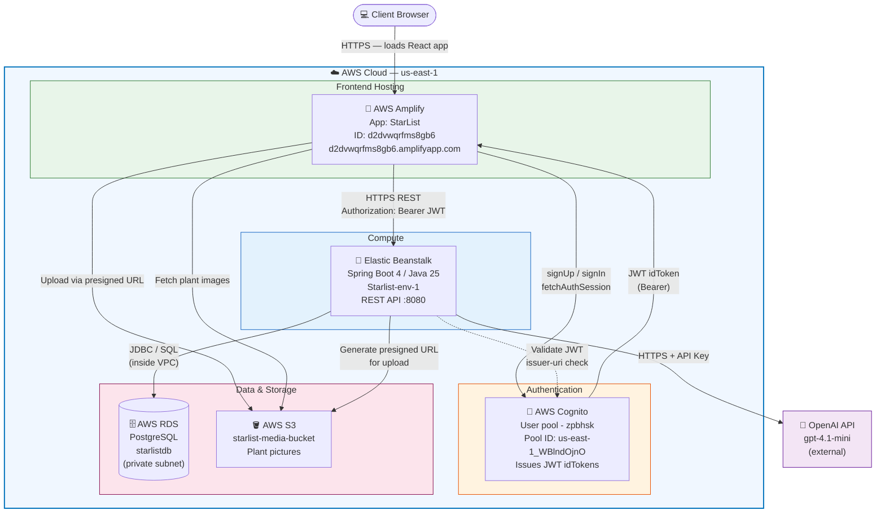

# StarList — AWS Architecture Diagram



> Dashed arrows (-.->): internal AWS calls not visible to the client.
> All services are **live** in `us-east-1`. S3 bucket name to be filled in once confirmed.

---

## Data Flow Walkthrough

### 1. User Loads the App
```
Browser → Amplify CDN (d2dvwqrfms8gb6.amplifyapp.com) → React bundle
```

### 2. Sign Up / Sign In
```
React (authService.ts)
  → aws-amplify/auth SDK → Cognito (us-east-1_WBlndOjnO)
  ← JWT idToken  (payload: sub = cognitoUserId)
```

### 3. REST API Calls
```
React (api.ts / axios)
  → Authorization: Bearer <idToken> → Beanstalk (Starlist-env-1) :8080

Spring Boot (Spring Security OAuth2 resource server)
  -.-> validates JWT against https://cognito-idp.us-east-1.amazonaws.com/us-east-1_WBlndOjnO
  → extracts cognitoUserId → looks up User in RDS (starlistdb)
  ← JSON response
```

### 4. Plant Picture Upload
```
React → GET /upload-url → Beanstalk → generates S3 presigned PUT URL
React → PUT <file bytes> directly to S3 presigned URL  (bypasses backend)
React → renders image from S3 URL
```

### 5. AI Chat
```
Spring Boot AiConversation service
  → OpenAI API (gpt-4.1-mini)
  ← response → persisted in RDS (AiConversation entity)
```

---

## Live Resource Reference

| Service | Resource | ID / Endpoint |
|---------|----------|---------------|
| Cognito | User pool - zpbhsk | `us-east-1_WBlndOjnO` |
| Cognito | App client | `12j25ufrhgbfei0fmdq33b9e1g` |
| Cognito | JWT issuer | `https://cognito-idp.us-east-1.amazonaws.com/us-east-1_WBlndOjnO` |
| Amplify | StarList app | `d2dvwqrfms8gb6` → `d2dvwqrfms8gb6.amplifyapp.com` |
| Beanstalk | Starlist-env-1 | `starlist-env-1.eba-gjim97su.us-east-1.elasticbeanstalk.com` |
| RDS | starlistdb | `starlistdb.cdxhnilumxca.us-east-1.rds.amazonaws.com:5432` |
| S3 | starlist-media-bucket | `starlist-media-bucket` |
